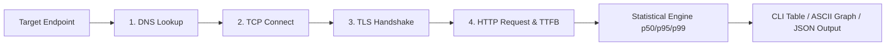

<div align="center">

# 🚀 `svcprobe`

### *CLI de Diagnóstico de Rede e Observabilidade de Alta Performance para Sistemas Distribuição*

[](https://golang.org)
[](LICENSE)
[](https://github.com/augusttw/svcprobe)
[](https://github.com/augusttw/svcprobe/pulls)

[English](README.md) | **Português (pt-BR)**

---

**`svcprobe`** é uma ferramenta única de diagnóstico de rede e observabilidade para microsserviços, containers, Kubernetes e sistemas distribuídos. Ele combina auditorias de **DNS, TCP, TLS e HTTP**, oferecendo decomposição da latência por fase, percentis estatísticos (**p50, p95, p99**) e exportação estruturada em **JSON**.

[Funcionalidades](#-funcionalidades) • [Instalação](#-instalação) • [Comandos](#-comandos) • [Exemplos](#-exemplos) • [Saída JSON](#-saída-json)

---

</div>

## 🌐 Por que usar o `svcprobe`?

Em arquiteturas distribuídas, diagnosticar falhas de comunicação entre serviços costuma exigir o uso de ferramentas isoladas (`dig`, `nc`, `curl`, `openssl`). 

O **`svcprobe`** consolida todo o ciclo de diagnóstico de rede em uma ferramenta única, leve e extremamente veloz em Go, capaz de identificar com precisão a causa raiz de falhas e gargalos de latência.



---

## ✨ Funcionalidades

- **🔍 Diagnóstico Multi-Camada Concatenado (`check`)**: Auditoria automática de ponta a ponta (DNS → TCP → TLS → HTTP) em uma única execução.
- **⏱ Decomposição da Latência HTTP (`httptrace`)**: Medição detalhada da duração de cada etapa: *DNS Lookup, TCP Connect, TLS Handshake, Time to First Byte (TTFB)* e *Data Transfer*.
- **🔒 Inspeção de Certificados TLS**: Validação da cadeia de certificados, verificação de expiração (alerta para certificados com <= 30 dias), SANs, cifras e protocolos (TLS 1.2 / TLS 1.3).
- **📊 Percentis Estatísticos**: Cálculo preciso de **p50, p95, p99**, mínimo, máximo, média e desvio padrão.
- **🚨 Motor de Diagnóstico de Falhas**: Categorização e identificação automática de DNS com falha, conexão TCP recusada, timeouts, HTTP 4xx/5xx e serviços lentos (`--slow-threshold`).
- **⚡ Alta Concorrência (Worker Pool)**: Probes em múltiplos endpoints em paralelo com Goroutines, Channels e controle por `context`.
- **🔄 Monitoramento Contínuo (`watch`)**: Dashboard em tempo real para observabilidade de endpoints com histórico acumulado.
- **🌲 Topologia em Gráfico ASCII (`graph`)**: Visualização elegante no terminal da topologia dos serviços e histograma comparativo da latência p95.
- **📄 Exportação JSON**: Saída padronizada em JSON para integração simples com CI/CD e pipelines de observabilidade.
- **🛡 Zero Dependências Externas**: Feito prioritariamente com a biblioteca padrão de redes do Go.

---

## 💻 Instalação

### Compilando a partir do código fonte

```bash
# Clone o repositório
git clone https://github.com/augusttw/svcprobe.git
cd svcprobe

# Compile o binário
go build -o svcprobe main.go

# (Opcional) Instale no sistema
go install ./cmd/svcprobe
```

---

## 🛠 Comandos

| Comando | Descrição |
| :--- | :--- |
| `svcprobe check` | Executa diagnóstico multi-camada completo (DNS → TCP → TLS → HTTP) |
| `svcprobe watch` | Monitoramento contínuo em tempo real com estatísticas dinâmicas |
| `svcprobe dns` | Probe dedicado de resolução DNS (suporta resolver customizado via `--server`) |
| `svcprobe tcp` | Probe dedicado de estabelecimento de socket TCP |
| `svcprobe tls` | Probe dedicado de handshake TLS e inspeção de certificados SSL |
| `svcprobe http` | Probe dedicado de requisição HTTP com decomposição de latência TTFB |
| `svcprobe graph` | Visão geral visual em ASCII da topologia dos serviços e percentis |
| `svcprobe version` | Exibe a versão atual |
| `svcprobe help` | Exibe o guia de uso e opções |

---

## 🎛 Flags e Parâmetros

| Flag | Descrição | Padrão |
| :--- | :--- | :--- |
| `-n, --samples` | Número de amostras de teste por endpoint | `5` |
| `-t, --timeout` | Tempo limite (timeout) por tentativa | `5s` |
| `-i, --interval` | Intervalo entre amostras ou ciclo do watch | `200ms` |
| `-c, --concurrency` | Quantidade máxima de worker goroutines paralelas | `10` |
| `-o, --output` | Formato de saída (`table`, `json`, `json-pretty`) | `table` |
| `--server` | Resolver DNS customizado (ex: `8.8.8.8:53`) | `Resolver do Sistema` |
| `--slow-threshold` | Limiar para alerta de serviço lento | `500ms` |
| `--method` | Método HTTP (`GET`, `POST`, `HEAD`, etc.) | `GET` |
| `-k, --insecure` | Ignorar verificação de certificado TLS | `false` |
| `--no-color` | Desativar cores ANSI | `false` |

---

## 📖 Exemplos de Uso

### 1. Auditoria geral de múltiplos serviços
```bash
./svcprobe check https://api.github.com http://localhost:8080 tcp://db.internal:5432
```

**Saída no terminal:**
```text
SVCPROBE DIAGNOSTIC SUMMARY (2 targets probed in 1.42s)
Health Overview: HEALTHY: 2 | WARNING: 0 | UNHEALTHY: 0
──────────────────────────────────────────────────────────────────────────────────────────────────
TARGET                           TYPE   STATUS   MIN      P50      P95      P99      LOSS%  ISSUES  
──────────────────────────────────────────────────────────────────────────────────────────────────
https://api.github.com           HTTP   ✔ PASS   120.4ms  125.1ms  138.9ms  140.2ms  0%     None    
http://localhost:8080            HTTP   ✔ PASS   1.2ms    1.4ms    1.9ms    2.1ms    0%     None    
──────────────────────────────────────────────────────────────────────────────────────────────────

  ► Latency Phase Decomposition [https://api.github.com]:
    DNS Lookup:    750.00µs   | TCP Handshake: 18.50ms    | TLS Handshake: 32.10ms   
    Time to 1st Byte: 45.20ms    | Data Transfer: 23.60ms    | Total Request: 120.10ms  
```

### 2. Inspeção de Certificado TLS
```bash
./svcprobe tls google.com:443 --samples 3
```

**Análise do certificado:**
```text
  ► TLS Certificate Analysis [google.com:443]:
    Subject: *.google.com | Issuer: WR2
    Protocol: TLS 1.3 | Cipher: TLS_AES_128_GCM_SHA256 | Expires: 2026-10-12 (59 days remaining)
```

### 3. Visualização da Topologia em Gráfico ASCII
```bash
./svcprobe graph https://api.github.com https://google.com
```

```text
┌────────────────────────────────────────────────────────────────────────┐
│                       SERVICE DIAGNOSTIC TOPOLOGY                      │
└────────────────────────────────────────────────────────────────────────┘

Endpoints Dependency & Latency Breakdown:
─────────────────────────────────────────
├── [HTTP] https://api.github.com         ✔ PASS
│   ├── Percentiles: p50=125.10ms p95=138.90ms p99=140.20ms
│   └── Latency Visual: [████████████████████░░░░░] (p95: 138.90ms)

└── [HTTP] https://google.com             ✔ PASS
    ├── Percentiles: p50=386.78ms p95=401.26ms p99=402.54ms
    └── Latency Visual: [█████████████████████████] (p95: 401.26ms)
```

---

## 📄 Saída JSON Estruturada

O `svcprobe` permite exportar resultados em formato JSON completo para auditoria ou integrações:

```bash
./svcprobe check https://1.1.1.1 -n 2 -o json-pretty
```

```json
{
  "timestamp": "2026-08-13T17:46:30.753440024-03:00",
  "total_targets": 1,
  "healthy_count": 1,
  "warning_count": 0,
  "unhealthy_count": 0,
  "total_duration_ns": 420000000,
  "targets": [
    {
      "target": "https://1.1.1.1",
      "probe_type": "http",
      "total_samples": 2,
      "success_samples": 2,
      "failed_samples": 0,
      "packet_loss_pct": 0,
      "stats": {
        "min_ns": 160889360,
        "max_ns": 218312481,
        "mean_ns": 189600920,
        "p50_ns": 189600920,
        "p95_ns": 215441324,
        "p99_ns": 217738249
      },
      "last_sample": {
        "success": true,
        "duration_ns": 160889360,
        "breakdown": {
          "dns_lookup_ns": 696082,
          "tcp_connect_ns": 24851375,
          "tls_handshake_ns": 32690922,
          "ttfb_ns": 39462375,
          "transfer_ns": 669255,
          "total_ns": 160889360
        },
        "http": {
          "status_code": 200,
          "status_text": "200 OK",
          "proto": "HTTP/1.1",
          "content_length": 56614
        }
      }
    }
  ]
}
```

---

## 🧪 Testes

Para rodar a suíte completa de testes de unidade e integração:

```bash
go test -v ./...
```

---

## 📄 Licença

Distribuído sob a licença **MIT**. Veja [`LICENSE`](LICENSE) para mais informações.

---

<div align="center">
Desenvolvido com ❤️ por <a href="https://github.com/augusttw"><b>augusttw</b></a>
</div>
